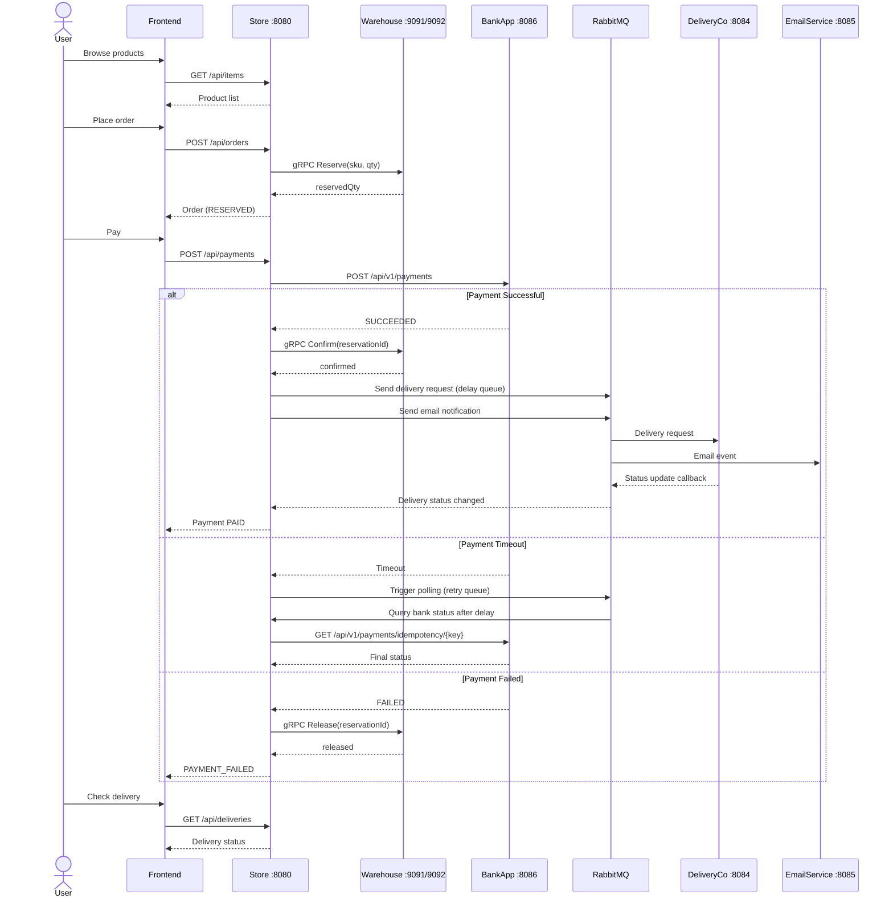

# Distributed E-Commerce Ecosystem

A high-availability distributed e-commerce system built on microservices architecture, featuring four core modules: **Storefront**, **Warehouse**, **Payment**, and **Logistics**. The system achieves cross-service coordination via **gRPC** for low-latency inventory operations, **RESTful API** for user-facing interactions, and **RabbitMQ** for asynchronous event-driven communication — with emphasis on distributed data consistency and system resilience.

> 🏗️ Designed and implemented as a COMP5348 (Distributed Systems) group project, demonstrating key distributed systems patterns including **Saga orchestration**, **Dead Letter Queues with exponential backoff**, **pessimistic locking for concurrency control**, and **idempotent operations**.

---

## ✨ Key Highlights

- 🔗 **gRPC Communication** — Store ↔ Warehouse via strongly-typed Protocol Buffers with deadline control
- 🐇 **RabbitMQ Event-Driven** — Payment polling with 3-tier retry queues (3s→6s→9s) + DLQ; delivery delay queues; async email notifications
- 🔒 **Concurrency Safety** — Pessimistic locking (`SELECT FOR UPDATE`) on stock + optimistic locking (`@Version`) on orders
- 🔄 **Saga Pattern** — End-to-end order lifecycle with compensating transactions (release/refund) on failure
- 🛡️ **Idempotency** — Every reservation and bank payment uses idempotency keys to prevent duplicate operations
- 🐘 **Multi-Database** — Separate PostgreSQL databases per service, sharing a single Postgres instance
- 🖥️ **Full-Stack** — React 18 frontend with JWT authentication, type-safe API layer, and responsive UI

---

## Table of Contents

- [Architecture Overview](#architecture-overview)
- [Tech Stack](#tech-stack)
- [Directory Structure](#directory-structure)
- [Core Features](#core-features)
- [Prerequisites](#prerequisites)
- [Installation & Setup](#installation--setup)
- [API Documentation](#api-documentation)
- [Usage Examples](#usage-examples)
- [Design Highlights](#design-highlights)
- [License](#license)

## Architecture Overview



## Tech Stack

| Category | Technology |
|----------|-----------|
| **Backend Framework** | Spring Boot 3.3.x, Java 17 |
| **Build Tool** | Gradle 8.8 |
| **Inter-Service RPC** | gRPC with Protocol Buffers (grpc-spring-boot-starter) |
| **Message Broker** | RabbitMQ 4 (with Management UI) |
| **Database** | PostgreSQL 16 (Alpine) |
| **ORM** | Spring Data JPA / Hibernate |
| **API Documentation** | SpringDoc OpenAPI / Swagger UI |
| **Authentication** | JWT (JSON Web Token) |
| **Frontend** | React 18, TypeScript, Vite, React Router v6, Axios |
| **Containerization** | Docker Compose |
| **Database Admin** | pgAdmin 4 |
| **Utility** | Lombok, Logback (JSON logging) |

## Directory Structure
```text
.
├── Store/                                 # Core backend services (Gradle multi-project)
│   ├── common/                            # Shared module: enums, DTOs, utilities
│   │   └── src/main/java/Tutorial7_8/Common/
│   │       ├── enums/                     # OrderStatus, PaymentStatus, ReservationStatus, etc.
│   │       └── dto/                       # Shared DTOs
│   │
│   ├── proto/                             # gRPC Protobuf definitions & generated code
│   │   └── src/main/proto/
│   │       └── warehouse.proto            # WarehouseService RPC definition
│   │
│   ├── store-app/                         # Main Store application
│   │   └── src/main/java/Tutorial7_8/Store/
│   │       ├── config/                    # CORS, RabbitMQ, Swagger, Data Initializer
│   │       ├── controller/                # REST Controllers (Order, Item, User, Payment, Delivery)
│   │       ├── dto/                       # Request/Response DTOs
│   │       ├── error/                     # Global exception handling
│   │       ├── middleware/                # JWT authentication filter
│   │       ├── model/                     # JPA Entities (Order, Item, User, Payment, Delivery, OutboxEvent)
│   │       ├── repository/                # Spring Data JPA Repositories
│   │       ├── service/                   # Business logic services
│   │       │   ├── delivery/              # Delivery service + RabbitMQ (delay send, status update)
│   │       │   ├── Email/                 # Email service + RabbitMQ (delay send)
│   │       │   ├── payment/               # Payment service + RabbitMQ (polling with retry + DLQ)
│   │       │   ├── InventoryService.java  # gRPC client for Warehouse
│   │       │   ├── OrderService.java      # Order lifecycle management
│   │       │   └── ...
│   │       └── utils/
│   │
│   ├── warehouse/                         # Warehouse service (supports 2 instances)
│   │   └── src/main/java/Tutorial7_8/warehouse/
│   │       ├── config/                    # DB & stock initializers
│   │       ├── model/                     # Reservation, WarehouseStock entities
│   │       ├── repository/                # ReservationRepository, WarehouseStockRepository
│   │       └── rpc/                       # gRPC service implementation (WarehouseService)
│   │
│   ├── db/                                # Database init scripts
│   ├── compose.yaml                       # Docker Compose (PostgreSQL + pgAdmin + RabbitMQ)
│   ├── build.gradle                       # Root build configuration
│   └── settings.gradle                    # Multi-project: common, proto, store-app, warehouse
│
├── 3rdParty/                              # Third-party service simulators
│   ├── BankApp/                           # Banking service (Spring Boot :8086)
│   │   └── src/main/java/com/bank/BankApp/
│   │       ├── controller/                # PaymentController, AccountController
│   │       ├── service/                   # Payment processing with idempotency
│   │       └── ...
│   │
│   ├── DeliveryCo/                        # Delivery company service (Spring Boot :8084)
│   │   └── src/main/java/com/delivery/DeliveryCo/
│   │       ├── controllers/               # Delivery instance management
│   │       ├── mq/                        # RabbitMQ producer for status updates
│   │       ├── simulators/                # Delivery status simulation
│   │       └── ...
│   │
│   └── EmailService/                      # Email notification service (Spring Boot :8085)
│       └── src/main/java/com/email/EmailService/
│           ├── messaging/                 # RabbitMQ listener for email events
│           └── ...
│
├── frontend/                              # React frontend application
│   ├── src/
│   │   ├── pages/                         # Page components
│   │   │   ├── Login.tsx                  # User login
│   │   │   ├── Register.tsx               # User registration
│   │   │   ├── Products.tsx               # Product listing with stock info
│   │   │   ├── Orders.tsx                 # Order list
│   │   │   ├── OrderNew.tsx               # Create new order
│   │   │   ├── OrderPay.tsx               # Payment page
│   │   │   ├── OrderDetail.tsx            # Order detail
│   │   │   ├── Deliveries.tsx             # Delivery list
│   │   │   └── DeliveryDetail.tsx         # Delivery detail
│   │   ├── services/api.ts                # Axios client with JWT interceptor
│   │   ├── App.tsx                        # Router & auth guard
│   │   └── main.tsx                       # Entry point
│   ├── package.json
│   ├── vite.config.ts
│   └── tsconfig.json
│
├── LICENSE                                # MIT License
└── Setup the Store-App.md                 # Original setup guide
```


## Core Features

### 1. Order Lifecycle Management
Complete order flow with state machine: `CREATED → RESERVED → PAID → SHIPMENT_REQUESTED → DELIVERED`

### 2. gRPC-based Inventory Reservation
Store communicates with Warehouse services via gRPC for low-latency, type-safe inventory operations:
- **Reserve**: Pre-deduct inventory across multiple warehouses
- **Confirm**: Finalize deduction after successful payment
- **Release**: Rollback reservation on payment failure/cancellation
- **Stock Query**: Real-time stock level inquiry

### 3. Payment with Resilient Polling
- Synchronous HTTP call to BankApp with 2s timeout
- On timeout/uncertainty: asynchronous RabbitMQ-based polling with exponential backoff (3s → 6s → 9s)
- Dead Letter Queue (DLQ) for exhausted retries
- Automatic order cancellation after 3 failed polling attempts
- Bank callback support for async payment confirmation

### 4. Asynchronous Delivery Coordination
- RabbitMQ delay queue (10s) for delivery request scheduling
- DeliveryCo simulates multi-step shipping: `WAREHOUSE_PICKUP → TO_CUSTOMER`
- Status updates flow back to Store via RabbitMQ

### 5. Event-Driven Email Notifications
- Email events published to RabbitMQ on order status changes (cancellation, refund, etc.)
- EmailService consumes and processes notifications asynchronously

### 6. Data Consistency Guarantees
- **Pessimistic Locking**: Warehouse stock operations use `SELECT ... FOR UPDATE`
- **Optimistic Locking**: Order entity uses JPA `@Version`
- **Idempotency**: Reservation IDs and payment idempotency keys prevent duplicate operations
- **Transactional Integrity**: `@Transactional` with `findByIdForUpdate` on critical paths

## Prerequisites

- **Java 17** (JDK)
- **Gradle 8.8+** (wrapper included)
- **Node.js 18+** and **npm**
- **Docker** and **Docker Compose**
- **Git**

## Installation & Setup

### Step 1: Clone the Repository

```bash
git clone https://github.com/<your-username>/<your-repo>.git
cd <your-repo>
```

### Step 2: Start Infrastructure (PostgreSQL + RabbitMQ + pgAdmin)

```bash
cd Store
docker compose up -d
```

This will start:

- PostgreSQL on port 5433 (databases: store, warehouse1, warehouse2)
- RabbitMQ on ports 5672 (AMQP) and 15672 (Management UI)
- pgAdmin on port 5051

**Default Credentials:**

| Service    | Username                                  | Password |
| ---------- | ----------------------------------------- | -------- |
| PostgreSQL | admin                                     | admin    |
| RabbitMQ   | admin                                     | admin    |
| pgAdmin    | [admin@admin.com](mailto:admin@admin.com) | admin    |

### Step 3: Build the Store Project

**bash**

```bash
cd Store
./gradlew build          # Linux/macOS
gradlew.bat build        # Windows
```

> **Note**: Building is required because gRPC stubs are generated from `.proto` files during the build process.


### Step 4: Start Backend Services

Launch each service in separate terminal windows:

**Store Application (port 8080):**

```bash
cd Store
./gradlew :store-app:bootRun
```

**Warehouse 1 (port 8081, gRPC 9091):**

```bash
cd Store
./gradlew :warehouse:bootRun --args='--spring.profiles.active=warehouse1'
```

Or run `Warehouse1Application.java` from your IDE.

**Warehouse 2 (port 8082, gRPC 9092):**

```bash
# Run Warehouse2Application.java from your IDE
```

**BankApp (port 8086):**

```bash
cd 3rdParty/BankApp
./gradlew bootRun
```

**DeliveryCo (port 8084):**

```bash
cd 3rdParty/DeliveryCo
./gradlew bootRun
```

**EmailService (port 8085):**

```bash
cd 3rdParty/EmailService
./gradlew bootRun
```

### Step 5: Start the Frontend

```bash
cd frontend
npm install
npm run dev
```

The frontend will be available at [`http://localhost:5173`](http://localhost:5173/).

## API Documentation

Once the Store application is running, access the Swagger UI:

```url
http://localhost:8080/docs
```

### Key API Endpoints

| Method | Endpoint                | Description                              |
| ------ | ----------------------- | ---------------------------------------- |
| POST   | `/api/users/register`   | Register a new user                      |
| POST   | `/api/users/login`      | Login and get JWT token                  |
| GET    | `/api/items`            | List all products                        |
| GET    | `/api/items/{id}/stock` | Get product stock across warehouses      |
| POST   | `/api/orders`           | Create a new order (auto-reserves stock) |
| GET    | `/api/orders`           | List user's orders                       |
| GET    | `/api/orders/{id}`      | Get order details                        |
| POST   | `/api/orders/cancel`    | Cancel an order                          |
| POST   | `/api/payments`         | Process payment for an order             |
| POST   | `/api/payments/refund`  | Refund a payment                         |
| GET    | `/api/deliveries`       | List user's deliveries                   |
| GET    | `/api/deliveries/{id}`  | Get delivery details                     |

## Usage Examples

### 1. Register & Login

```bash
# Register
curl -X POST http://localhost:8080/api/users/register \
  -H "Content-Type: application/json" \
  -d '{"email":"user@example.com","password":"password123","name":"John"}'

# Login
curl -X POST http://localhost:8080/api/users/login \
  -H "Content-Type: application/json" \
  -d '{"email":"user@example.com","password":"password123"}'
# Response: { "token": "eyJhbGciOi..." }
```

### 2. Browse Products & Check Stock

```bash
# List products
curl http://localhost:8080/api/items \
  -H "Authorization: Bearer <token>"

# Check stock for item #1
curl http://localhost:8080/api/items/1/stock \
  -H "Authorization: Bearer <token>"
```

### 3. Create Order & Pay

```bash
# Create order (auto-reserves from available warehouses)
curl -X POST http://localhost:8080/api/orders \
  -H "Authorization: Bearer <token>" \
  -H "Content-Type: application/json" \
  -d '{"item_id": 1, "quantity": 2}'
# Order status: RESERVED

# Pay for order
curl -X POST http://localhost:8080/api/payments \
  -H "Authorization: Bearer <token>" \
  -H "Content-Type: application/json" \
  -d '{"orderId": 1, "customerAccount": "ACC-001"}'
# Order status: PAID → triggers delivery
```

### 4. Cancel Order

```bash
curl -X POST http://localhost:8080/api/orders/cancel \
  -H "Authorization: Bearer <token>" \
  -H "Content-Type: application/json" \
  -d '{"orderId": 1}'
# If RESERVED → releases warehouse stock
# If PAID → initiates refund via bank
```

## Design Highlights

### Distributed Data Consistency

- **Saga Pattern**: Order creation → Stock reservation → Payment → Stock confirmation → Delivery, with compensating transactions (release/refund) on failure
- **Outbox Pattern**: `OutboxEvent` entity for reliable event publishing
- **Idempotent Operations**: Every warehouse reservation and bank payment uses idempotency keys

### RabbitMQ Queue Topology

```code
Payment Polling:
  pay.status.q ← (check)     ← pay.status.ex
  pay.status.q.retry1 (TTL 3s, DLX → check)
  pay.status.q.retry2 (TTL 6s, DLX → check)
  pay.status.q.retry3 (TTL 9s, DLX → check)
  pay.status.q.fail (DLQ - Dead Letter Queue)

Delivery Delay:
  delivery.delay.q ← (send)  ← delivery.delay.ex
  delivery.delay.q.delay10 (TTL 10s, DLX → send)
  delivery.delay.q.fail (DLQ)

Delivery Status Update:
  delivery.update.q ← (send) ← delivery.update.ex
  delivery.update.q.fail (DLQ)

Email Send:
  email.send.q ← (send)      ← email.send.ex
  email.send.q.fail (DLQ)
```

### Concurrency Control

- **Pessimistic Lock**: `SELECT ... FOR UPDATE` on warehouse stock operations prevents overselling
- **Optimistic Lock**: JPA `@Version` on Order entity detects concurrent modifications
- **gRPC Timeout**: 2-second deadline on reserve calls, 500ms on release calls

## Port Reference

| Service      | HTTP Port                | gRPC Port | DB Port |
| ------------ | ------------------------ | --------- | ------- |
| Store        | 8080                     | —         | 5433    |
| Warehouse-1  | 8081                     | 9091      | 5433    |
| Warehouse-2  | 8082                     | 9092      | 5433    |
| BankApp      | 8086                     | —         | 5436    |
| DeliveryCo   | 8084                     | —         | 5434    |
| EmailService | 8085                     | —         | 5435    |
| Frontend     | 5173                     | —         | —       |
| RabbitMQ     | 15672 (UI) / 5672 (AMQP) | —         | —       |
| pgAdmin      | 5051                     | —         | —       |

## License

This project is licensed under the MIT License — see the [LICENSE](./LICENSE) file for details.
